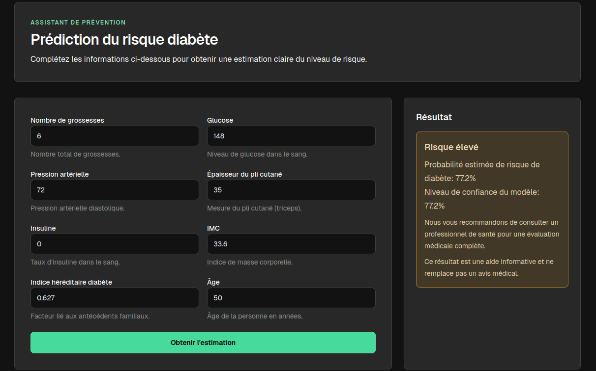

# ML Fullstack Starter

Starter fullstack ML avec:

- Backend FastAPI pour la prédiction
- Frontend Next.js exporté en statique et servi par Nginx
- Orchestration Docker Compose

## Aperçu

Le frontend appelle l'API via la route same-origin /api/v1/predict.
Nginx proxy les appels API vers le service Docker api sur le port 8000.

## Capture d'écran

## Lancement rapide avec Docker

Depuis la racine du projet:

1. docker compose build --no-cache
2. docker compose up -d

Applications disponibles:

- Frontend: http://localhost
- API Health: http://localhost/api/v1/health
- API Docs (accès direct backend hors proxy): http://localhost:8000/docs (si port publié)

## Structure du projet

- backend: API FastAPI, modèle ML, entraînement et tests
- |_ data: jeux de données
- |_ models: artefacts modèles
- |_ notebooks: expérimentations
- frontend: interface utilisateur Next.js et config Nginx

## Variables importantes

Frontend:

- NEXT_PUBLIC_API_BASE_URL=/

Cette valeur force les appels API en same-origin pour éviter les erreurs CORS côté navigateur.

## Commandes utiles

- docker compose ps
- docker compose logs -f frontend
- docker compose logs -f api

